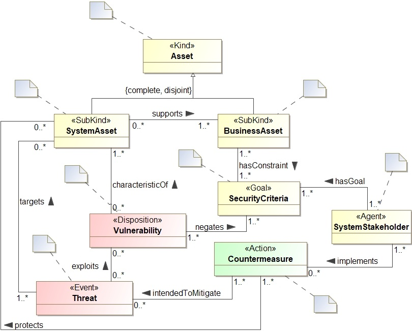

# Blockchain-based Ontology Driven Reference Framework (OntRef)

Blockchain-based Ontology Driven Reference Framework (OntRef) encodes information security concepts following the fundamental concepts of security risk management (SRM). The OntRef provides semantic interoperability, general concepts which are common to all domains, and enables a common foundation for ontologies in the information security domain. The OntRef presents a structural representation that can support the dynamic knowledge encoding and instantiation with an information security knowledge of domain-specific systems for SRM.

## OntRef Architecture
The OntRef defines the fundamental concepts of SRM, such as assets, security criteria, threats, vulnerabilities, countermeasures, and their relationships. The SRM concept are grounded with six different unified foundational ontology (UFO) concepts.

We use the Protégé editor to code the concepts and relationships of OntRef using the web ontology language (OWL). The concepts are encoded as classes that illustrates the upper-level class hierarchies for the SRM of domain-specific applications. Relationships in OntRef present object properties that define the link between two concepts. For instance, an object property **exploits** linking the threat and  vulnerability concepts (*threat* ``exploits`` *vulnerability*).

## Classification of OntRef
Protégé-based classification illustrates the class hierarchies along with their defined relationships.

### Class hierarchies

OntRef "is-a" based taxonomical structure illustrates the class hierarchies.

## How to use?
Download [Protégé](https://protege.stanford.edu) editor. Load/import [OntRef](https://mmisw.org/ont/~mubashar/OntRef) in Protégé and navigate to the *Entities* tab to explore the encoded security risk management concepts.