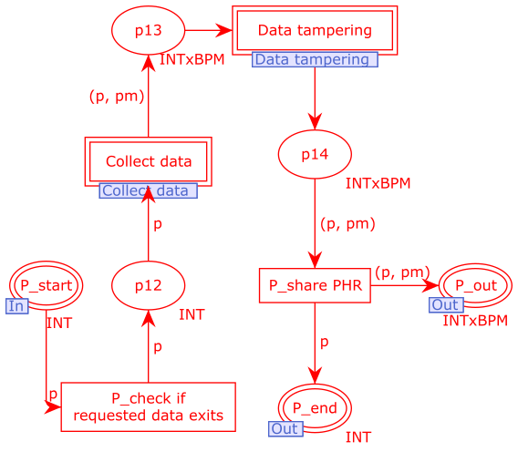
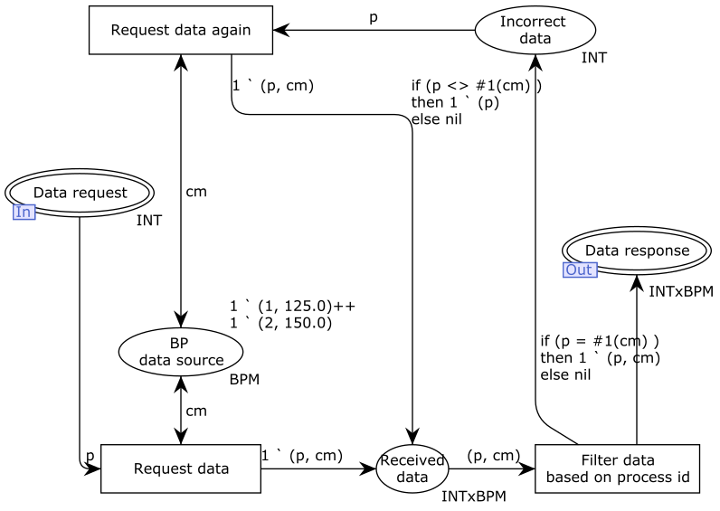
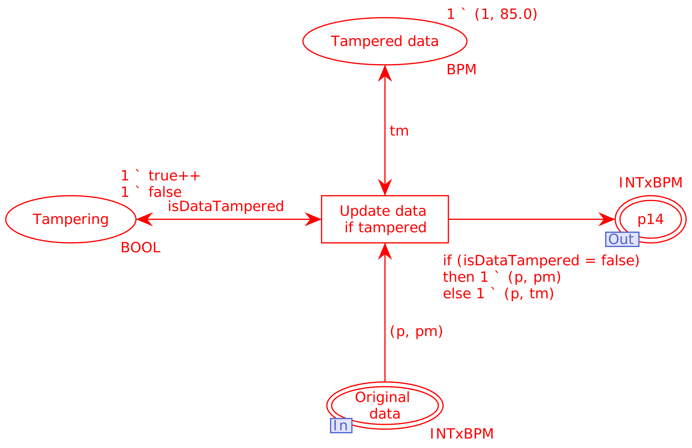
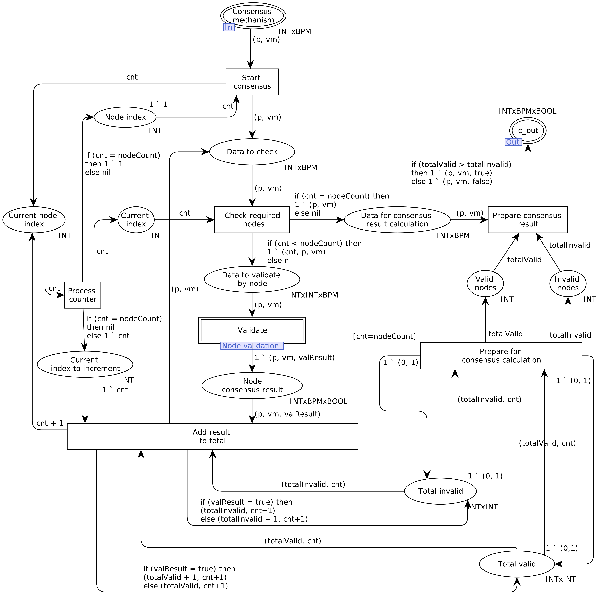
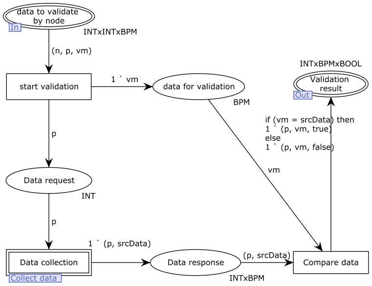
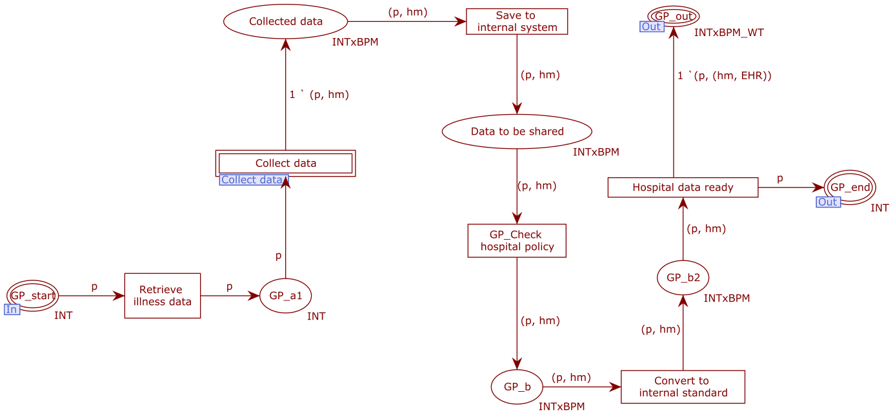
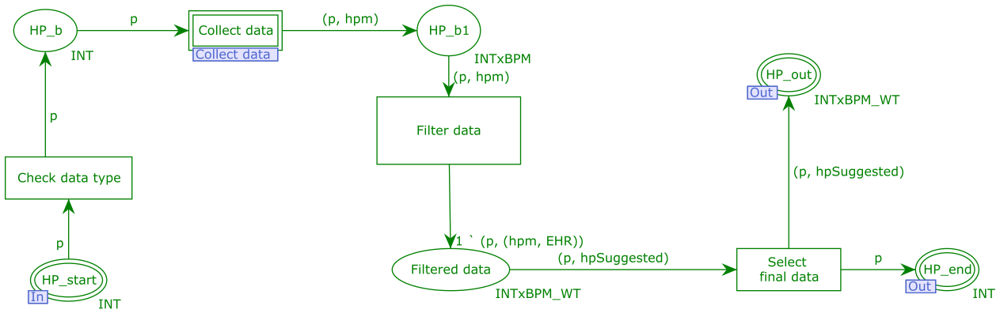
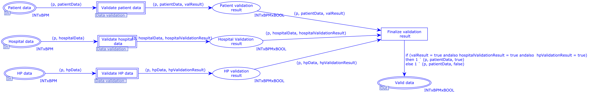

# Colored Petri Nets (CPNs) models

## 1. External layer

    

## 2. Patient Internal Process

    

## 3. Collect Data

    

## 4. Data Tampering

    

## 5. Consensus

    

## 6. Node Validation

    

## 7. Healthcare Provider Internal Process

    

## 8. Healthcare Professional Internall Process

    

## 9. Insurance Claim Data Validation

    

